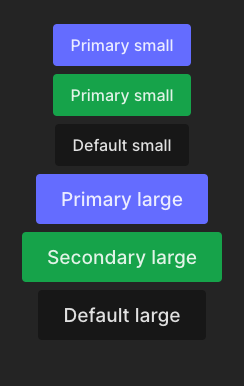

# Style

Pour une page web, il te faut des styles.

Il y a de nombreuses façons de faire les styles en React et je vais **t'en présenter 5.**

PS : oui tu vas devoir update toujours le même fichier en modifiant
les styles donc tu vas à chaque exercice devoir supprimer ce que tu as fait.
Mais les solutions sont là pour garder l'historique.

## Exercise - Plain style

En react comme en HTML tu peux simplement utiliser la propriété `style` pour définir un style.

En HTML tu fais comme ça :

```html
<div style="color: red;">Hello</div>
```

Mais en JSX tu vas devoir faire comme ceci. En utilisant un objet :

```jsx
<div style={{ color: "red" }}>Hello</div>
```

[📖 Doc React sur les styles](https://fr.reactjs.org/docs/dom-elements.html#style)

L'avantage, c'est que ce sera typé. Si tu mets un number pour la couleur tu as une erreur !

Utilise la propriété `style` pour définir un style. Voici ce que tu dois réaliser :



Les styles et comment les appliquer sont décrits dans le fichier d'exercice.

- 💌 Tu apprends à utiliser les inline style en React.

### Problème

- duplication des styles
- pas possible d'utiliser les pseudo-classes (hover, focus)
- pas possible d'utiliser les media queries
- rend les fichiers moins lisibles

## Extra 2 - Global style

On va créer des styles globaux.

Tu peux aller dans le fichier [global.css](src/exercise/1-style/global.css) et voir qu'il existe déjà un style pour `.button`.

Pour que les styles fonctionnent, il va falloir importer le fichier `global.css` dans le fichier `Exercise1.js`.

💡 `import "./global.css";`

Tu vas pouvoir déplacer les styles par défaut dans ce fichier !

Pour t'apprendre une technique, tu retrouveras dans le fichier `global.css` des css variables.
Comme `var(--background-color)`. On va passer par le tag `style` pour définir la css variable.

Les CSS variables permettent de passer des styles de notre JS à notre CSS.

```jsx
<button style={{ ["--background-color"]: "#f0f0f0" }}>Coucou</button>
```

```css
button {
  background-color: var(--background-color);
}
```

Je te laisse essayer de trouver le moyen de faire ça en utilisant nos objects `VariantsStyle`
et je t'explique tout dans la solution. Tu peux ajouter une class `container` pour déplacer
les styles mis dans la `div` du composant `Demo`.

[📖 Doc React sur les ClassName](https://fr.reactjs.org/docs/faq-styling.html)

ℹ️ Sans les CSS variables on devrait définir une classe pour chaque variant (`primary`, `secondary`...)
et pour chaque size (`large`, `small`) et les ajouter conditionnellement.
C'est une autre façon de faire qui est aussi très bien !

🤯 Pour aller plus loin, tu peux ajouter les styles de hover/focus etc...

💌 Tu apprends à utiliser les styles globaux et tu comprends le problème.

### Problème

- toute l'application va avoir ce style (si un autre button dans l'application a la class `customButton`, c'est le style qui sera appliqué)
  - avec plus de 100 components je peux te dire que les styles globaux vont devenir un joyeux bordel
- il faut chercher où les styles ont été définis

## Extra 3 - CSS Module

C'est celui qu'on va utiliser dans le cadre de cette formation.

C'est la même chose que les styles globaux dans l'aspect, mais ils sont "scopés" à ton composant.
C'est-à-dire que la class `button` ne sera qu'accessible dans le fichier `Exercise1.jsx` ou
tout autre fichier qui importe le `Composant.module.css`.

Tu dois nommer tes fichiers CSS Module comme ça : `ComponentName.module.css`.

Ensuite, pour l'utiliser, tu peux l'importer comme ceci :

`import styles from "./Composant.module.css";`

Dans le fichier tu pourras mettre par exemple :

```css
.button {
  background-color: red;
}
```

Et tu pourras donc utiliser les styles comme ceci :

```jsx
import styles from "./Composant.module.css";

<button className={styles.button}>Hello</button>;
```

[📖 Doc sur les CSS Module](https://github.com/css-modules/css-modules)

Tu peux faire exactement que les styles globaux mais changer l'import et c/c ton code
dans le fichier `Composant.module.css`.

J'explique les détails dans la correction.

Remplace les styles globaux par des CSS Module. (Oublie pas le style du composant `Demo`)

Le fichier existe déjà (`Exercise1.module.css`)

- 💌 Tu comprends comment fonctionne les CSS Module et leur utilité.

🤯 Pour aller plus loin, tu peux ajouter les styles de hover/focus etc...

## Extra 4 - Tailwind CSS (BONUS)

⚠️ Il faut te rendre dans le fichier [index.html](/index.html) et décommenter la ligne 8
pour ajouter la library Tailwind au projet ! ⚠️

Tailwind est le framework populaire du moment. Dans le projet final de
cette formation, on va l'utiliser pour notre projet.

Il faut donc que tu saches le maîtriser.

Avec Tailwind je vais te faire découvrir la lib incontournable : `clsx`.

Déjà Tailwind est une library "Utility First". Elle offre des classes
prédéfinies qui te permettent d'ajouter des styles sans passer par un fichier
CSS. Directement dans le HTML.

Tailwind possède un Playground où tu peux t'amuser, je t'ai [préparé
une démo](https://play.tailwindcss.com/ZtvTfomsMR) qui vient de [hyperui
](https://www.hyperui.dev/components/marketing/buttons) qui est une library
de composant pour Tailwind. Tu as juste à copier-coller le code HTML.

Tailwind est très optimisé, c'est-à-dire qu'il va ajouter à ton Application
**uniquement les classes que tu utilises dans ton app.**

Par exemple si on a une app qui possède uniquement ce button :

```html
<button class="bg-red-500 p-2 rounded-lg text-white">Hello</button>
```

Tailwind va générer ce CSS :

```css
.rounded-lg {
  border-radius: 0.5rem;
}

.bg-red-500 {
  --tw-bg-opacity: 1;
  background-color: rgb(239 68 68 / var(--tw-bg-opacity));
}

.p-2 {
  padding: 0.5rem;
}

.text-white {
  --tw-text-opacity: 1;
  color: rgb(255 255 255 / var(--tw-text-opacity));
}
```

**Et pas de CSS en plus inutile.**

Pour faire notre bouton, tu vas devoir définir les styles par défaut ainsi que pour
les variants et sizes.

[📖 Tailwind - bg-color](https://tailwindcss.com/docs/background-color)

Pour les couleurs tu peux utiliser :

- primary : `bg-[#646cff]`
- secondary : `bg-green-600`
- default: `bg-neutral-900`

* [📖 Padding dans Tailwind](https://tailwindcss.com/docs/padding)
* [📖 Font-size dans Tailwind](https://tailwindcss.com/docs/font-size)
* [📖 Border-radius dans Tailwind](https://tailwindcss.com/docs/border-radius)

Ensuite, la library [NPM clsx](https://www.npmjs.com/package/clsx) est juste
un utilitaire pour faire des className.

Voici un petit exemple :

```jsx
const variant = "primary";
<button className={clsx("button", { ["primary"]: variant === "primary", ["secondary"]: variant === "secondary" })}>
  Hello
</button>
// Equal
<button className="button primary">Hello</button>
```

Elle permet d'ajouter conditionnellement des classes CSS. Evident dans
une application.

À toi de jouer, enlève les CSS Module et utilise Tailwind !

- 💌 Tu comprends comment fonctionne `Tailwind` et `clsx`

🤯 Pour aller plus loin, tu peux ajouter les styles de hover/focus etc...

## Extra 5 - Styled-components : css-in-js (BONUS)

⚠️ Il faut te rendre dans le fichier [index.html](/index.html) et commenter la ligne 8
pour enlever la library Tailwind au projet ! ⚠️

[Styled-components](https://styled-components.com/docs/basics) est une library React pour faire des styles.

Elle fait ses styles directement dans le JS.

Elle va générer des classes name unique pour nos composants. Cette library va nous permettre
de faire des styles, gérer les variants, le thème etc...

J'en aborde le sujet dans la formation **pour que tu saches que ça existe.**

On ne va pas aborder toute la puissance de ce genre de library mais c'est très utilisé
dans l'industrie.

### Usage

```jsx
const Button = styled.button({
  // en utilisant une fonction tu va pouvoir définir des styles conditionnellement
  // ici avec un block
  backgroundColor: (props) => {
    if (props.variant === "red") return "red";
    else if (props.variant === "green") return "green";
    else return "white";
  },
  color: "white",
  // ici j'utilise un ternaire pour définir la largeur du bouton en fonction
  // de la props "size"
  padding: (props) => (props.size === "sm" ? "8px 12px" : "16px 20px"),
});

const Demo = () => {
  return (
    <div>
      <Button variant="red" size="sm">
        Hello
      </Button>
      <Button variant="green">Hello</Button>
    </div>
  );
};
```

Refactor notre bouton pour utiliser `styled-components` et enlève Tailwind.

- 💌 Tu découvres le `CSS-in-JS` et tu sais qu'il existe.

🤯 Pour aller plus loin, tu peux ajouter les styles de hover/focus etc...
